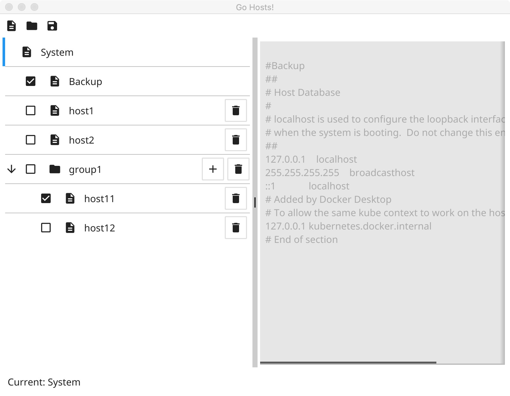

# gohosts（WIP）
A hosts tool by golang via [fyne](https://fyne.io).

------

### Summary

The gohosts is a useful system hosts file editing tool. It is implemented with golang via [fyne](https://fyne.io). Support Windows, Linux, MACOS.

### Features

- Back up the system hosts file.
- Switch to enable the HostsItem (the hosts fragment).
- Use HostsGroup to manage multiple HostsItem.

### Screenshot



### Building

- Linux / MACOS
``` shell
    git clone http://github.com/tk103331/gohosts.git
    cd gohosts
    go build
    sudo ./gohosts
```
- Windows (Need to run with administrator rights)
``` shell
    git clone http://github.com/tk103331/gohosts.git
    cd gohosts
    go build
    gohosts
```

### TODO

- Optimize interface and interaction.
- Support multiple grouping strategies (exclusive, etc.).
- Support loading from network and file.
